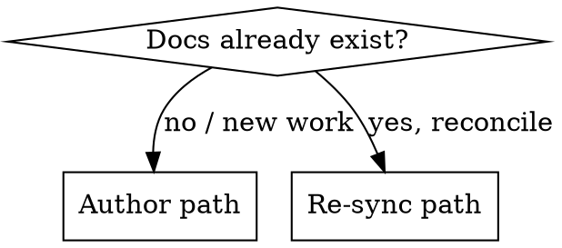

# Requirements-driven planning

Announce at the start: **"Using requirements-driven-planning: clarify → pick the doc set → write living requirements → route the implementation plan → hand off."**

**Core principle: the requirements are the source of truth, and the code is downstream of them.** An implementation plan is for machines to execute and humans to throw away. A **PRD/ERD/DRD** is what a human reads in six months to understand *what we promised, how we built it, and what the data means* — so it must outlive the plan and stay true to the code. This skill produces that living family of docs and keeps them honest with one **shared ID spine** ([the spine](#the-spine)), then feeds a routed implementation plan to `multi-model-implementation` (model-routed-delivery).

This is a **self-contained planning loop** — it runs its own clarify → design → document flow. It does not depend on a separate brainstorming skill.

## When to use / not

- **Use** before building anything non-trivial where the "why" and "how" must survive: features, whole projects, migrations, schema changes.
- **Use** in re-sync mode when code has drifted from the docs, or docs exist but were never reconciled.
- **Don't** use for a one-line fix, a copy tweak, or throwaway spikes — there's nothing to keep in sync. A PRD for a typo fix is waste.

## Two entry paths

---

## Path A — Author

### A0. Clarify before you write

Do **not** write requirements on assumptions. Ask **only the questions whose answers change the docs** — one at a time, multiple-choice when you can: the problem being solved and for whom, success metrics, scope boundaries (in/out), fail modes, tenancy, data sensitivity, environment ceilings, the decisions that fork the architecture. A wrong assumption baked into a PRD propagates into every downstream task. Get the forking decisions on the record first.

### A1. Pick the doc set (adaptive)

Produce **only what the project warrants**. Decide with the requester, then confirm.

| Doc | Produce when | Skip when |
|---|---|---|
| **PRD** (`templates/prd.md`) | **Always.** Every change has a why. | Never skip — but scale it: a few paragraphs for small work. |
| **ERD** (`templates/erd.md`) | A **new external dependency**, a **new service/module boundary**, a cross-cutting concern (security/observability/cost), or a **rejected alternative worth recording** exists | None of those apply — an obvious single-pattern change with no trade-off to weigh |
| **DRD** (`templates/drd.md`) | Work adds or changes **persistent data**: schemas, entities, relationships, or anything touching **PII/retention** | No data model change (stateless, read-only, or reuses existing schema unchanged) |
| **API contract** (`templates/api-contract.md`) | Work **exposes or changes a service boundary or a public/consumed API** | No API surface changes |
| **Test & QA plan** (`templates/test-qa-plan.md`) | Feature has **non-trivial behavior or integration** to verify beyond unit tests | Trivial change fully covered by per-task `TEST-` |
| **Implementation plan** (`templates/implementation-plan.md`) | More than one obvious task | A single self-evident task |

*(Other docs worth adding by hand when the work warrants: a **threat model** on the security spine, an **ops readiness / rollout** doc for prod-facing changes and migrations, an **RFC** to precede the ERD on a contentious decision.)*

State which docs you're producing and **why each other one is skipped** — a skipped DRD on a feature that stores user data is a red flag, not a shortcut.

### A2. Write the docs

Fill the templates in `templates/`. Read `reference.md` for the per-section intent and the anti-patterns that kill each doc type (PRDs that prescribe solutions instead of stating problems; ERDs with no *alternatives-considered*; DRDs whose diagram and data-dictionary drift apart). Requirements docs go in **`docs/requirements/`**, the plan in **`docs/plans/`** (project conventions override these defaults).

Every requirement, entity, decision, and task gets a **stable ID from the spine**. This is not optional bookkeeping — it is the mechanism that makes the docs syncable. Give each doc its **diagrams** ([Diagrams](#diagrams)) as you write it.

### A3. Build the routed implementation plan

Decompose into atomic `TASK-###`s (exact file paths, the interface each produces, a `TEST-###` verify step that needs **no human interpretation**). Then rate each task's **difficulty on its hardest aspect** and route it to a model tier — this is exactly the Phase 1–2 discipline of the **`multi-model-implementation`** skill (Easy→small, Medium→mid, Hard→top; anything on the security/money/auth/data-integrity spine is Hard regardless of size, and is additionally flagged **`observe`** for a mandatory adversarial review). Record the tier and any `observe` flag in each task. The concrete **tier→model mapping is owned by `multi-model-implementation`**, not this skill — record tiers, not model names. **When a plan exists, hand it to `multi-model-implementation`** to orchestrate the build (a single self-evident task needs no plan and no handoff).

### A4. Traceability check (do this every time)

Run the [checklist](#traceability-checklist) by hand. Fix gaps inline. Then hand off.

---

## Path B — Re-sync

When docs already exist and may have drifted:

1. **Read** the current PRD/ERD/DRD/plan and the relevant code.
2. **Run the [traceability checklist](#traceability-checklist)** against reality — treat code as ground truth for *what is*, and the PRD as ground truth for *what was promised*.
3. **Report drift** explicitly before editing: orphan requirements (no task/code), untraceable code (no requirement), schema ↔ data-dictionary mismatches, missing PII/retention on stored data, `ADR`s contradicted by the code.
4. **Reconcile** — update the docs to match reality where the code is correct; open follow-up tasks where the code is wrong. Never silently rewrite a promise; call out what changed and why.

---

## Diagrams

**A diagram is a teaching aid, not a data dump. If a reader can't grasp it in ten seconds, it has failed.**

- **≤ 5–6 boxes per diagram.** If it needs more, you are drawing two diagrams — split it. No exceptions; a seventh box is a new diagram.
- **Split by zoom, using C4 levels.** When a system won't fit in six boxes, don't cram — **stack levels**: **Context** (the system + who/what touches it, ~3–5 boxes) → **Container** (the apps/services/stores inside it) → **Component** (inside one container). Each level is its own tiny diagram; the reader drills down instead of squinting.
- **ELI5 caption under every diagram.** One plain-language line — *"In plain terms: …"* — no jargon, as if explaining to a five-year-old. If you can't, you don't understand it yet.
- **Label every box with its spine ID** (`ENT-001 User`, a component tagged with the `REQ-`/`ADR-` it serves). The label is what lets a diagram be checked against the docs.

**Tool: Excalidraw.** Author each diagram as an `.excalidraw` scene in `docs/requirements/diagrams/` — clone `templates/diagram.excalidraw` (a valid 2-box starter) and extend it. Export with **"Embed scene" ON** to `<name>.excalidraw.svg`: that one SVG is both the picture GitHub renders and the re-editable source. Embed it in the doc — `` — and keep the embedded SVG as the source of truth; never hand-edit its paths.

Excalidraw is a canvas, not diagram-as-code, so scenes don't diff cleanly — **the ID labels are the sync mechanism**: every `ENT`/component in a doc is a labeled box and vice-versa (enforced by the [checklist](#traceability-checklist)). *(StarVector — https://github.com/joanrod/star-vector — is an optional side-path only: use it to vectorize a whiteboard photo into a starter scene, never as the source of a structural diagram.)*

Which diagram belongs in which doc is in `reference.md`.

## The spine

One shared ID namespace links every doc. This is what turns "keep them in sync" from a wish into a check.

| Prefix | Lives in | Meaning |
|---|---|---|
| `REQ-###` | PRD | Functional requirement |
| `NFR-###` | PRD | Non-functional requirement (perf, security, a11y, compliance) |
| `ADR-###` | ERD | An architecture decision (one decision each; supersede, never edit) |
| `ENT-###` | DRD | A data entity / table |
| `TASK-###` | Plan | An atomic unit of work (its file paths are their own identifiers) |
| `TEST-###` | Plan | A task's verify step / acceptance check, cited by the `REQ` it proves |

**Linking rules:** every `TASK` cites the `REQ`/`NFR` it satisfies → every `REQ` has ≥1 `TASK` and a `TEST-` → `ENT`s trace to the `REQ`s that need them → `ADR`s are cited by the tasks that implement them → PII `ENT`s carry a classification and a retention rule.

**Extension IDs** (only when their doc exists — same linking discipline): `API-###` (API operations in the contract; each cites the `REQ` it serves and the `ENT` it touches) · `TC-###` (scenario test cases in the Test & QA plan; each cites a `REQ`/`NFR`).

**ID scope:** each ID is unique within its prefix across the whole doc set — one continuous `TASK-` sequence across all phases, one `REQ-` sequence across the PRD. Prefixes keep IDs unambiguous between docs.

## Traceability checklist

- [ ] Every `REQ`/`NFR` maps to ≥1 `TASK`. (Unmapped → unbuilt promise.)
- [ ] Every `TASK` cites ≥1 `REQ`/`NFR`. (Uncited → scope creep or dead work.)
- [ ] Every `REQ` has a `TEST-` / acceptance criterion. (PRD success metrics ↔ plan `TEST-`s.)
- [ ] Every `ENT` traces to a `REQ`; every persisted field has a classification and each entity a retention rule.
- [ ] ERD design/interfaces ↔ DRD schema ↔ DRD data dictionary agree (names, types, cardinality).
- [ ] Every `ADR` is referenced by the task(s) that implement it; no code contradicts an accepted `ADR`.
- [ ] Every diagram has ≤6 boxes and an ELI5 caption; anything bigger is split by C4 level, not crammed.
- [ ] Every `ENT`/major component is an ID-labeled box, and every box maps to a spine ID.
- [ ] No placeholders (`TBD`, "similar to above", "add error handling") in any doc.

## Built to sync outward (connectors)

These docs are designed to leave the repo and live in a knowledge base without losing their structure. Nothing ships an integration yet — the docs are **connector-ready**, not connected.

- **Machine-readable front-matter.** Every template opens with a YAML block (`doc`, `title`, `status`, `owner`, `last_synced`, `confluence_page_id`, `jira_project_key`). A connector reads and writes these — e.g. stamps the Confluence page id on first push so re-sync updates that page instead of duplicating it. Keep the block intact and filled.
- **The spine is the join key.** The doc set maps to a Confluence page tree; `REQ-`→Jira stories under a PRD **epic**, `TASK-`→the stories' sub-tasks (via the `REQ` each task cites), `TEST-`/`TC-`→acceptance criteria. Stable IDs mean the connector upserts by id, never duplicates.
- See `connectors.md` for the full mapping and `ROADMAP.md` for what's built vs. planned.

## Red flags — stop if you catch yourself thinking…

| Rationalization | Reality |
|---|---|
| "The implementation plan covers it; I'll skip the PRD." | The plan is disposable. Without the PRD nobody knows *why*, and re-sync has no source of truth. |
| "It stores user data but a DRD is overkill." | Persisted data without a DRD means undocumented PII and no retention rule. That's a liability, not a shortcut. |
| "I'll assign IDs later." | IDs are the spine. No IDs, no traceability, no sync. Assign them as you write. |
| "One design; no need for alternatives-considered." | If there were truly no alternatives, say so in one line. Usually there were, and the reader needs the reasoning. |
| "The code changed; I'll update the docs eventually." | 'Eventually' is how docs die. Run re-sync now, or the requirements stop being true. |
| "I'll write the plan myself and route later." | Route as you decompose. The tier is a property of the task, decided when you understand its hardest aspect. |
| "Requirements look done — ship the plan." | Run the traceability checklist first. An orphan requirement is an unbuilt promise. |

---

*Inspired by the brainstorm-before-code discipline of [obra/superpowers](https://github.com/obra/superpowers), Google's design-doc structure, Amazon's working-backwards PR/FAQ, and Nygard-style ADRs. It composes with this repo's `multi-model-implementation` (model-routed-delivery) skill: this skill produces the spec/PRD and the routed plan that skill requires as input.*
