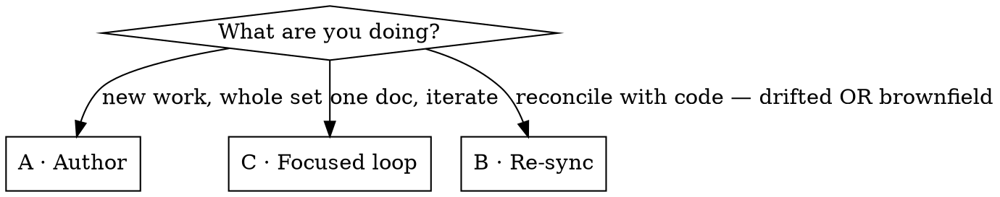

# Requirements-driven planning

Announce at the start: **"Using requirements-driven-planning: pick the mode → clarify → write living docs → route the plan → hand off."** ([Modes](#modes): author · focused-loop · re-sync.)

**Core principle: the requirements are the source of truth, and the code is downstream of them.** An implementation plan is for machines to execute and humans to throw away. A **PRD/ERD/DRD** is what a human reads in six months to understand *what we promised, how we built it, and what the data means* — so it must outlive the plan and stay true to the code. This skill produces that living family of docs and keeps them honest with one **shared ID spine** ([the spine](#the-spine)), then feeds a routed implementation plan to `model-routed-delivery` — the **execute** stage of the pipeline (plan → execute → implement), which dispatches each task to a worker running `clean-implementation`.

This is a **self-contained planning loop** — it runs its own clarify → design → document flow. It does not depend on a separate brainstorming skill.

## When to use / not

- **Use** before building anything non-trivial where the "why" and "how" must survive: features, whole projects, migrations, schema changes.
- **Use** in re-sync mode when code has drifted from the docs, or docs exist but were never reconciled.
- **Don't** use for a one-line fix, a copy tweak, or throwaway spikes — there's nothing to keep in sync. A PRD for a typo fix is waste.

## Modes

Three ways to run this skill. **Focused-loop (C) is the everyday one** — one doc, one unit at a time. Author (A) is the up-front pass for new work. **Re-sync (B) reconciles docs with code** — whether they've drifted *or don't exist yet*: reverse-engineering a brownfield repo into the doc set is the same job, started from empty, because code is the source of truth either way.

```dot
digraph modes {
  "What are you doing?" [shape=diamond];
  "A · Author" [shape=box];
  "C · Focused loop" [shape=box];
  "B · Re-sync" [shape=box];
  "What are you doing?" -> "A · Author" [label="new work, whole set"];
  "What are you doing?" -> "C · Focused loop" [label="one doc, iterate"];
  "What are you doing?" -> "B · Re-sync" [label="reconcile with code — drifted OR brownfield"];
}
```

---

## Path A — Author

### A0. Clarify before you write

Do **not** write requirements on assumptions. Ask **only the questions whose answers change the docs** — one at a time, multiple-choice when you can: the problem being solved and for whom, success metrics, scope boundaries (in/out), fail modes, tenancy, data sensitivity, environment ceilings, the decisions that fork the architecture. A wrong assumption baked into a PRD propagates into every downstream task. Get the forking decisions on the record first.

### A1. Pick the doc set (adaptive)

Produce **only what the project warrants**. Decide with the requester, then confirm.

| Doc | Produce when | Skip when |
|---|---|---|
| **PRD** (`templates/prd.md`) | **Always.** Every change has a why. | Never skip — but scale it: a few paragraphs for small work. |
| **ERD** (`templates/erd.md`) | A **new external dependency**, a **new service/module boundary**, a cross-cutting concern (security/observability/cost), or a **rejected alternative worth recording** exists | None of those apply — an obvious single-pattern change with no trade-off to weigh |
| **DRD** (`templates/drd.md`) | Work adds or changes **persistent data**: schemas, entities, relationships, or anything touching **PII/retention** | No data model change (stateless, read-only, or reuses existing schema unchanged) |
| **API contract** (`templates/api-contract.md`) | Work **exposes or changes a service boundary or a public/consumed API** | No API surface changes |
| **User flows** (`templates/user-flows.md`) | Work has a **user-facing surface** — screens, navigation, forms | Headless/API-only, CLI, or backend job (no UI) |
| **Wireframes** (`templates/wireframes.md`) | There are **screens to lay out** (usually whenever user flows exist) | No UI, or a copy/style-only tweak |
| **Style guide** (`design-system/style-guide.md`) | Introducing **net-new visual language**, or the org has no design system yet | A UI exists and the org design system already covers it — **reference it, list only net-new `CMP-`** |
| **Release plan** (`templates/release-plan.md`) | **Prod-facing deploy, migration, cutover, or rollback** | Internal library / no-deploy change |
| **Observability** (`templates/observability.md`) | Runs as a **live service with health to watch** | Pure library, build-time, or one-shot |
| **User docs** (`templates/user-docs.md`) | **End-user-visible behavior changes** | Internal-only refactor |
| **Test & QA plan** (`templates/test-qa-plan.md`) | Feature has **non-trivial behavior or integration** to verify beyond unit tests | Trivial change fully covered by per-task `TEST-` |
| **Implementation plan** (`templates/implementation-plan.md`) | More than one obvious task | A single self-evident task |

*(Other docs worth adding by hand when the work warrants: a **threat model** on the security spine, an **RFC** to precede the ERD on a contentious decision. Rollout/ops-readiness now has its own doc — the **release plan**.)*

State which docs you're producing and **why each other one is skipped** — a skipped DRD on a feature that stores user data is a red flag, not a shortcut.

### A2. Write the docs

Fill the templates in `templates/`. Read `reference.md` for the per-section intent and the anti-patterns that kill each doc type (PRDs that prescribe solutions instead of stating problems; ERDs with no *alternatives-considered*; DRDs whose diagram and data-dictionary drift apart). Requirements docs go in **`docs/requirements/`**, the plan in **`docs/plans/`** (project conventions override these defaults). The **style guide is the exception** — it's cross-project and long-lived, so it lives in **`design-system/`** and is *referenced, not regenerated* per feature.

Every requirement, entity, decision, and task gets a **stable ID from the spine**. This is not optional bookkeeping — it is the mechanism that makes the docs syncable. Give each doc its **diagrams** ([Diagrams](#diagrams)) as you write it.

### A3. Build the routed implementation plan

Decompose into atomic `TASK-###`s (exact file paths, the interface each produces, a `TEST-###` verify step that needs **no human interpretation**). Then rate each task's **difficulty on its hardest aspect** and route it to a model tier — this is exactly the Phase 1–2 discipline of the **`model-routed-delivery`** skill (Easy→small, Medium→mid, Hard→top; anything on the security/money/auth/data-integrity spine is Hard regardless of size, and is additionally flagged **`observe`** for a mandatory adversarial review). Record the tier and any `observe` flag in each task. The concrete **tier→model mapping is owned by `model-routed-delivery`**, not this skill — record tiers, not model names. **When a plan exists, hand it to `model-routed-delivery`** to orchestrate the build (a single self-evident task needs no plan and no handoff).

**UI build constraint.** For work with a user-facing surface, add a **global constraint** to the plan: *UI/site tasks are built with the [Impeccable](https://github.com/pbakaus/impeccable) skill* — it extends `frontend-design` with an anti-slop design vocabulary and builds against the [style guide](#a1-pick-the-doc-set-adaptive)'s tokens/components. `model-routed-delivery` copies global constraints verbatim into every worker's brief, and `clean-implementation` (the worker's manual) treats "build UI with Impeccable" as a rule — so each frontend agent inherits it without per-task repetition.

**Quality-bar constraint.** Add a **global constraint** that *done* means green **and** clean: each task's acceptance is its `TEST-` passing **and** passing a code-quality review (`uncle-bob-clean-code` — one thing per unit, no bloat, SOLID, design patterns only where the problem warrants one). State it once; `model-routed-delivery` verifies it at **both** the worker and the orchestrator level, so every task inherits the bar without per-task repetition. A `TEST-` that a verbose or un-patterned solution can still pass is an incomplete acceptance criterion — the quality gate is part of *done*, not a later cleanup.

### A4. Traceability check (do this every time)

Run the [checklist](#traceability-checklist) by hand. Fix gaps inline. Then hand off.

---

## Path B — Re-sync (reconcile docs with code)

**Code is ground truth for what *is*; the PRD is ground truth for what was *promised*.** This one path covers both the drift check (docs exist) and reverse-engineering a **brownfield repo with no docs yet** — the skill knows how to read a project *back into* the doc set. The only difference is the starting point: existing docs to reconcile, or an empty `docs/requirements/` to fill.

1. **Read** the current docs (if any) and the relevant code — schema/migrations, routes, module graph, IaC/CI, dashboards/alerts, and **tests** (the richest signal for intended behavior).
2. **Reconstruct or reconcile**, assigning spine IDs. Pull each doc from its highest-signal source: schema→`ENT`, routes/OpenAPI→`API`, module graph/IaC→ERD C4, deploy config→release-plan, alert rules→`SLO`, routes+components→sitemap/flows (lossy), tests+guards+validation+config→candidate `REQ`/`NFR`.
3. **Mark what code can't tell you.** Code holds the *what* and *how*, almost never the *why*. Label each item `[extracted]` (read from code) · `[inferred]` (guessed — confirm) · `⚠ [needs-confirmation]` (unknowable from code: retention, success metrics, PII sensitivity, ADR alternatives, SLO targets, UX intent). **Never fabricate intent** — a `⚠` is honest; an invented retention rule or metric is drift shipped as truth. Default to leaving `⚠` markers **inline** rather than interrogating; hand those gaps to a focused loop (Path C) to fill when you want.
4. **Report drift / gaps** before editing: orphan requirements (no task/code), untraceable code (no requirement), schema ↔ data-dictionary mismatches, missing PII/retention on stored data, `ADR`s the code contradicts, and every `⚠`.
5. **Reconcile** — update the docs to match reality where the code is correct; open follow-up tasks where the code is wrong. Never silently rewrite a promise; call out what changed and why.

---

## Path C — Focused (one doc, loop-until-done)

The everyday mode. You name a doc and drive it forward one unit at a time — *"let's do the wireframes"*, *"add a wireframe for checkout"*, *"work on observability"*.

1. **Locate** the doc; scaffold it from its template if it doesn't exist yet.
2. **Load upstream context** so the doc derives from real inputs, not invention:
   - wireframes ← user-flows (`FLOW-`) ← PRD (`REQ-`) · user-flows ← PRD (`REQ-`) · release-plan ← ERD + DRD (migrations) · observability ← PRD (`NFR-`) + ERD.
   - Missing prerequisite? **Offer** to sketch it first or proceed from `REQ-` — never hard-block. (Asked for wireframes with no flows → *"rough the flow first, or go straight from the requirements?"*)
3. **Pick one unit** — a single screen / flow / SLO. Enumerate candidates from upstream (each `FLOW-` implies its screens), or take the unit the user named.
4. **Clarify** — ask questions until *that* unit is complete, then draft it (Excalidraw scene + section).
5. **Refine** — show the drafted unit; refine until the user approves it.
6. **Loop** — go to the next unit. Repeat until the user says done.
7. **Write** — allocate the next spine IDs and insert/update each unit **in place** (append — never regenerate the whole doc); add the diagram files; bump `last_synced`.
8. **Scoped check** — run only the [checklist](#traceability-checklist) rows touching the changed IDs (every new `SCR-` maps to a `FLOW-` and a `REQ-`); report drift.

**Loop discipline** (sourced from `superpowers` — `brainstorming`, `subagent-driven-development`, `executing-plans`):

- Ask **one question at a time**; multiple-choice when you can.
- After a unit is approved, go straight to the next — **do not ask "should I continue?"** The user ends the loop by saying done.
- A unit is complete only when its required states are filled (a screen with no empty/error state is not done). **No placeholders.**
- **Stop and ask only when**: genuinely ambiguous and unguessable, a prerequisite is missing, or the user says done.
- **Ask, never guess.** Never fabricate intent — an unknown becomes a question or a `⚠` marker, not an invented value.

---

## Diagrams

**A diagram is a teaching aid, not a data dump. If a reader can't grasp it in ten seconds, it has failed.**

- **≤ 5–6 boxes per diagram.** If it needs more, you are drawing two diagrams — split it. No exceptions; a seventh box is a new diagram.
- **Split by zoom, using C4 levels.** When a system won't fit in six boxes, don't cram — **stack levels**: **Context** (the system + who/what touches it, ~3–5 boxes) → **Container** (the apps/services/stores inside it) → **Component** (inside one container). Each level is its own tiny diagram; the reader drills down instead of squinting.
- **ELI5 caption under every diagram.** One plain-language line — *"In plain terms: …"* — no jargon, as if explaining to a five-year-old. If you can't, you don't understand it yet.
- **Label every box with its spine ID** (`ENT-001 User`, a component tagged with the `REQ-`/`ADR-` it serves). The label is what lets a diagram be checked against the docs.

**Tool: Excalidraw.** Author each diagram as an `.excalidraw` scene in `docs/requirements/diagrams/` — clone `templates/diagram.excalidraw` (a valid 2-box starter) and extend it. Export with **"Embed scene" ON** to `<name>.excalidraw.svg`: that one SVG is both the picture GitHub renders and the re-editable source. Embed it in the doc — `` — and keep the embedded SVG as the source of truth; never hand-edit its paths.

Excalidraw is a canvas, not diagram-as-code, so scenes don't diff cleanly — **the ID labels are the sync mechanism**: every `ENT`/component in a doc is a labeled box and vice-versa (enforced by the [checklist](#traceability-checklist)). *(StarVector — https://github.com/joanrod/star-vector — is an optional side-path only: use it to vectorize a whiteboard photo into a starter scene, never as the source of a structural diagram.)*

Which diagram belongs in which doc is in `reference.md`.

## The spine

One shared ID namespace links every doc. This is what turns "keep them in sync" from a wish into a check.

| Prefix | Lives in | Meaning |
|---|---|---|
| `REQ-###` | PRD | Functional requirement |
| `NFR-###` | PRD | Non-functional requirement (perf, security, a11y, compliance) |
| `ADR-###` | ERD | An architecture decision (one decision each; supersede, never edit) |
| `ENT-###` | DRD | A data entity / table |
| `NAV-###` | User flows | An IA / navigation node |
| `FLOW-###` | User flows | A user flow (cites the `REQ`s it stitches) |
| `SCR-###` | Wireframes | A screen / view (cites a `REQ`, appears in a `FLOW`) |
| `CMP-###` | Style guide | A design-system component |
| `TOK-###` | Style guide | A design token |
| `REL-###` | Release plan | A release / rollout step or gate |
| `SLO-###` | Observability | A service-level objective (cites the `NFR` it protects) |
| `TASK-###` | Plan | An atomic unit of work (its file paths are their own identifiers) |
| `TEST-###` | Plan | A task's verify step / acceptance check, cited by the `REQ` it proves |

**Linking rules:** every `TASK` cites the `REQ`/`NFR` it satisfies → every `REQ` has ≥1 `TASK` and a `TEST-` → `ENT`s trace to the `REQ`s that need them → `ADR`s are cited by the tasks that implement them → PII `ENT`s carry a classification and a retention rule. **UX/ops:** every user-facing `REQ` has ≥1 `SCR` → every `SCR` traces to a `REQ` and appears in a `FLOW` → every `SLO`/alert cites the `NFR` it protects → every irreversible `REL` step has a rollback.

**Extension IDs** (only when their doc exists — same linking discipline): `API-###` (API operations in the contract; each cites the `REQ` it serves and the `ENT` it touches) · `TC-###` (scenario test cases in the Test & QA plan; each cites a `REQ`/`NFR`).

**ID scope:** each ID is unique within its prefix across the whole doc set — one continuous `TASK-` sequence across all phases, one `REQ-` sequence across the PRD. Prefixes keep IDs unambiguous between docs.

## Traceability checklist

- [ ] Every `REQ`/`NFR` maps to ≥1 `TASK`. (Unmapped → unbuilt promise.)
- [ ] Every `TASK` cites ≥1 `REQ`/`NFR`. (Uncited → scope creep or dead work.)
- [ ] Every `REQ` has a `TEST-` / acceptance criterion. (PRD success metrics ↔ plan `TEST-`s.)
- [ ] *Done* is defined as green **and** clean: acceptance = the `TEST-` passing **plus** a code-quality gate (`uncle-bob-clean-code`, verified worker- and orchestrator-side), not tests alone.
- [ ] Every `ENT` traces to a `REQ`; every persisted field has a classification and each entity a retention rule.
- [ ] ERD design/interfaces ↔ DRD schema ↔ DRD data dictionary agree (names, types, cardinality).
- [ ] Every `ADR` is referenced by the task(s) that implement it; no code contradicts an accepted `ADR`.
- [ ] Every diagram has ≤6 boxes and an ELI5 caption; anything bigger is split by C4 level, not crammed.
- [ ] Every `ENT`/major component is an ID-labeled box, and every box maps to a spine ID.
- [ ] Every user-facing `REQ` has ≥1 `SCR`; every `SCR` traces to a `REQ` and appears in ≥1 `FLOW`; every `FLOW` cites the `REQ`s it stitches.
- [ ] Every interactive `SCR` covers empty / error / loading states; every net-new `CMP` a screen uses exists in the style guide (or is flagged net-new).
- [ ] Every `SLO`/alert cites the `NFR` it protects; every irreversible `REL` step has a rollback (or an explicit forward-fix-only note).
- [ ] No placeholders (`TBD`, "similar to above", "add error handling") in any doc.

## Built to sync outward (connectors)

These docs are designed to leave the repo and live in a knowledge base without losing their structure. Nothing ships an integration yet — the docs are **connector-ready**, not connected.

- **Machine-readable front-matter.** Every template opens with a YAML block (`doc`, `title`, `status`, `owner`, `last_synced`, `confluence_page_id`, `jira_project_key`). A connector reads and writes these — e.g. stamps the Confluence page id on first push so re-sync updates that page instead of duplicating it. Keep the block intact and filled.
- **The spine is the join key.** The doc set maps to a Confluence page tree; `REQ-`→Jira stories under a PRD **epic**, `TASK-`→the stories' sub-tasks (via the `REQ` each task cites), `TEST-`/`TC-`→acceptance criteria. Stable IDs mean the connector upserts by id, never duplicates.
- See `connectors.md` for the full mapping and `ROADMAP.md` for what's built vs. planned.

## Red flags — stop if you catch yourself thinking…

| Rationalization | Reality |
|---|---|
| "The implementation plan covers it; I'll skip the PRD." | The plan is disposable. Without the PRD nobody knows *why*, and re-sync has no source of truth. |
| "It stores user data but a DRD is overkill." | Persisted data without a DRD means undocumented PII and no retention rule. That's a liability, not a shortcut. |
| "I'll assign IDs later." | IDs are the spine. No IDs, no traceability, no sync. Assign them as you write. |
| "One design; no need for alternatives-considered." | If there were truly no alternatives, say so in one line. Usually there were, and the reader needs the reasoning. |
| "The code changed; I'll update the docs eventually." | 'Eventually' is how docs die. Run re-sync now, or the requirements stop being true. |
| "The UI shipped; I'll update the wireframes/flows later." | Same death by 'later'. If the built UI diverges from the wireframes, re-sync now — or the design docs stop being true. |
| "It's headless, but I'll add wireframes to be safe." | A wireframe for an API is noise. Produce UI docs only when there's a user-facing surface; state why you skipped them. |
| "Reverse-engineering the repo — I'll just fill in a sensible retention rule." | Inventing a retention rule, metric, or rationale from code is fabrication. Emit a `⚠` marker; never guess intent. |
| "I'll write the plan myself and route later." | Route as you decompose. The tier is a property of the task, decided when you understand its hardest aspect. |
| "Requirements look done — ship the plan." | Run the traceability checklist first. An orphan requirement is an unbuilt promise. |
| "The `TEST-` passes, so the task's acceptance is met." | Acceptance is green *and* clean. A verbose or un-patterned solution that passes its `TEST-` is still debt — the quality gate is part of *done*. |

---

*Inspired by the brainstorm-before-code discipline of [obra/superpowers](https://github.com/obra/superpowers), Google's design-doc structure, Amazon's working-backwards PR/FAQ, and Nygard-style ADRs. It is the **plan** stage of this repo's pipeline: `requirements-driven-planning` → `model-routed-delivery` (execute) → `clean-implementation` (implement). This skill produces the spec/PRD and the routed plan the execute stage requires as input.*
