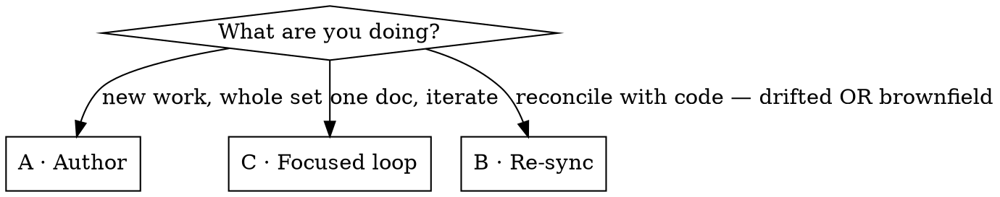

# Requirements-driven planning

Announce: **"Using requirements-driven-planning: pick the mode → clarify → write living docs → route the plan → hand off."**

**Core principle: the requirements are the source of truth; the code is downstream.** The implementation plan is disposable. The PRD/ERD/DRD are what a human reads in six months to learn what was promised, how it was built, and what the data means, so they must outlive the plan and stay true to the code. One shared ID spine keeps them checkable. The routed plan goes to `model-routed-delivery` (execute), which dispatches each task to a worker running `clean-implementation`.

This is a self-contained loop (clarify → design → document); it doesn't depend on a separate brainstorming skill.

**Use** before building anything non-trivial: features, projects, migrations, schema changes; and in re-sync mode when docs have drifted or don't exist. **Don't use** for a one-line fix, copy tweak, or throwaway spike.

## Modes

```dot
digraph modes {
  "What are you doing?" [shape=diamond];
  "A · Author" [shape=box];
  "C · Focused loop" [shape=box];
  "B · Re-sync" [shape=box];
  "What are you doing?" -> "A · Author" [label="new work, whole set"];
  "What are you doing?" -> "C · Focused loop" [label="one doc, iterate"];
  "What are you doing?" -> "B · Re-sync" [label="reconcile with code — drifted OR brownfield"];
}
```

**Focused loop (C) is the everyday mode.** Author (A) is the up-front pass for new work. Re-sync (B) reconciles docs with code, whether they drifted or were never written; a brownfield repo is re-sync from empty.

## Path A: author

### A0. Clarify

Ask only questions whose answers change the docs, one at a time, multiple-choice when possible: the problem and for whom, success metrics, scope in/out, fail modes, tenancy, data sensitivity, environment ceilings, decisions that fork the architecture. Get the forking decisions on the record first.

### A1. Pick the doc set

Produce only what the project warrants; confirm with the requester. State which docs you're skipping and why. A skipped DRD on a feature that stores user data is a red flag, not a shortcut.

| Doc | Produce when | Skip when |
|---|---|---|
| **PRD** (`templates/prd.md`) | **Always.** Every change has a why. | Never; scale it down to a few paragraphs for small work. |
| **ERD** (`templates/erd.md`) | A new external dependency, a new service/module boundary, a cross-cutting concern (security/observability/cost), or a rejected alternative worth recording | An obvious single-pattern change with no trade-off |
| **DRD** (`templates/drd.md`) | Work adds or changes persistent data: schemas, entities, relationships, PII/retention | No data-model change |
| **API contract** (`templates/api-contract.md`) | Work exposes or changes a service boundary or a public/consumed API | No API surface change |
| **User flows** (`templates/user-flows.md`) | A user-facing surface: screens, navigation, forms | Headless, CLI, or backend job |
| **Wireframes** (`templates/wireframes.md`) | Screens to lay out (usually whenever flows exist) | No UI, or a copy/style-only tweak |
| **Style guide** (`design-system/style-guide.md`) | Net-new visual language, or no design system exists yet | The org's design system covers it: reference it, list only net-new `CMP-` |
| **Release plan** (`templates/release-plan.md`) | Prod-facing deploy, migration, cutover, or rollback | Internal library / no-deploy change |
| **Observability** (`templates/observability.md`) | Runs as a live service with health to watch | Pure library, build-time, or one-shot |
| **User docs** (`templates/user-docs.md`) | End-user-visible behavior changes | Internal-only refactor |
| **Test & QA plan** (`templates/test-qa-plan.md`) | Non-trivial behavior or integration to verify beyond unit tests; anything with e2e tests | Trivial change covered by per-task `TEST-` |
| **Implementation plan** (`templates/implementation-plan.md`) | More than one obvious task | A single self-evident task |

Add by hand when warranted: a threat model for security / money / auth work; an RFC before the ERD on a contentious decision.

### A2. Write the docs

- Fill `templates/`. `reference.md` has per-section intent and the anti-patterns that kill each doc type.
- Requirements go in `docs/requirements/`, the plan in `docs/plans/`; project conventions override. The style guide lives in `design-system/`, cross-project and long-lived, referenced not regenerated per feature.
- Every requirement, entity, decision, and task gets a spine ID as you write it. Each doc gets its diagrams (below).

### A3. Build the routed plan

- Decompose into atomic `TASK-###`s: exact file paths, the interface each produces, a `TEST-###` verify step needing no human interpretation.
- Rate each task on its hardest aspect and assign a tier per `model-routed-delivery`'s table; record tiers, not model names. Which model the top tier maps to is the user's call: `model-routed-delivery` asks before using Fable and defaults to Opus. Flag `observe` only per its definition there (the true security/money spine). It should mark a small minority of tasks; a third or more flagged means re-rate.
- Add these **global constraints** once; `model-routed-delivery` copies them into every brief:
  - **UI**: built with [Impeccable](https://github.com/pbakaus/impeccable) against the style guide's tokens and components.
  - **Services** (API, worker, consumer, scheduled job): follow the [Twelve-Factor App](https://12factor.net); `clean-implementation` carries the checklist. Each service task names its config keys and env var names, backing services, port and health endpoints, and shutdown behavior; migrations and admin jobs are their own tasks. A deviation is an `ADR` the task cites.
  - **Quality bar**: done means the `TEST-` is green **and** the code is clean per `uncle-bob-clean-code`. Name the project's static gate command (format check, lint, type-check, complexity limit); every `TEST-` runs it alongside the task's tests. A `TEST-` that a bloated or over-engineered solution can still pass is not a complete acceptance criterion.
  - **Testing**: the plan names each command and tool; workers don't choose them.
    - *Coverage*: at least 90% line coverage, enforced by the coverage tool's fail-under threshold so it fails the run without anyone reading a report. Exclusions (generated or vendored code) are listed in the plan.
    - *Real backing services*: code that talks to a database, queue, or cache is tested against the real thing started by Docker Compose (a `compose.test.yaml` with health checks), never a mock or an in-memory substitute.
    - *End-to-end*: anything deployable or runnable gets e2e tests that drive it through its public surface, with the whole stack brought up by Docker Compose when it has backing services. Pick the driver by surface: browser UI → Playwright; HTTP API → requests against the running service; CLI → invoke the built binary and assert on output and exit code; library → none beyond tests of its public API. No Playwright without a browser UI.
    - The compose file and e2e harness are an M0 task; each e2e scenario is a `TC-` built by its own task.
  - **Design canon**: known patterns (`design-patterns`) over invention; rich domains via `domain-driven-design`, whose glossary and bounded contexts go in the PRD/ERD and inform module boundaries; `refactoring` is a plannable task type with a behavior-unchanged verify.
  - **Simplicity**: the four rules in `uncle-bob-clean-code` bind the docs and the plan as well as the code. YAGNI: no requirement, entity, endpoint, or task without a stated need behind it; "future-proofing" is out of scope until someone asks for it. KISS: the ERD picks the simplest architecture that meets the PRD and records what it declined to add. DRY: each fact lives in one doc and the others cite its spine ID. Convention over configuration: the chosen stack's standard layout, naming, and tooling are the default; a deviation is an `ADR`.
- Hand the plan to `model-routed-delivery`. A single self-evident task needs neither a plan nor a handoff.

### A4. Traceability check

Run the [checklist](#traceability-checklist) every time; fix gaps inline; then hand off.

## Path B: re-sync

Code is ground truth for what *is*; the PRD for what was *promised*. The same path serves drifted docs and a brownfield repo with none.

1. **Read** existing docs and the code: schema/migrations, routes, module graph, IaC/CI, dashboards/alerts, and tests (the richest signal of intent).
2. **Reconstruct or reconcile** with spine IDs, from the highest-signal source: schema→`ENT`, routes/OpenAPI→`API`, module graph/IaC→ERD C4, deploy config→release plan, alert rules→`SLO`, routes+components→sitemap/flows, tests+guards+validation→candidate `REQ`/`NFR`.
3. **Mark what code can't say.** `[extracted]` (read directly from code) · `[inferred]` (a guess from code; confirm it) · `⚠ [needs-confirmation]` (unknowable from code: retention, success metrics, PII sensitivity, ADR alternatives, SLO targets, UX intent). Never fabricate intent; leave `⚠` inline and fill it via Path C later.
4. **Report drift before editing**: orphan requirements, untraceable code, schema ↔ data-dictionary mismatches, missing PII/retention, `ADR`s the code contradicts, every `⚠`.
5. **Reconcile.** Update docs where the code is right; open tasks where it's wrong. Never silently rewrite a promise.

## Path C: focused loop

Name a doc and drive it one unit at a time ("let's do the wireframes", "add a wireframe for checkout").

1. **Locate** the doc; scaffold it from its template if missing.
2. **Load upstream**: wireframes ← user flows (`FLOW-`) ← PRD (`REQ-`); release plan ← ERD + DRD; observability ← PRD (`NFR-`) + ERD. Missing prerequisite → offer to sketch it or proceed from `REQ-`; never hard-block.
3. **Pick one unit** (a screen, a flow, an SLO) from the upstream candidates or the user's ask.
4. **Clarify** until that unit is complete, then draft it (Excalidraw scene + section).
5. **Refine** with the user until approved.
6. **Loop** to the next unit until the user says done.
7. **Write** in place with the next spine IDs (append, never regenerate the doc); add diagram files; bump `last_synced`.
8. **Scoped check**: only the checklist rows touching the changed IDs.

Loop discipline: one question at a time, multiple-choice when possible. After approval go straight to the next unit; don't ask "should I continue?". A unit with missing required states (a screen without empty/error states) is not done. No placeholders. Stop only when genuinely ambiguous or the user says done; a missing prerequisite is an offer (step 2), not a stop. An unknown becomes a question or a `⚠`, never an invented value.

## Diagrams

A diagram is a teaching aid. If a reader can't grasp it in ten seconds, split it.

- **≤ 6 boxes.** A seventh box is a new diagram.
- **Split by C4 level**: Context (the system and who touches it) → Container (apps, services, stores) → Component (inside one container). Each level is its own diagram.
- **ELI5 caption** under every diagram: "In plain terms: …".
- **Spine-ID labels** on every box (`ENT-001 User`; a component tagged with its `REQ-`/`ADR-`). Labels are the sync mechanism, since scenes don't diff cleanly.
- **Excalidraw**: scenes in `docs/requirements/diagrams/`, cloned from `templates/diagram.excalidraw`. Export with "Embed scene" on to `<name>.excalidraw.svg` and embed it (``). The SVG is both picture and source; never hand-edit its paths. [StarVector](https://github.com/joanrod/star-vector) may vectorize a whiteboard photo into a starter scene, nothing more.
- Which diagram goes in which doc: `reference.md`.

## The spine

One shared ID namespace links every doc and turns "keep them in sync" into a check.

| Prefix | Lives in | Meaning |
|---|---|---|
| `REQ-###` | PRD | Functional requirement |
| `NFR-###` | PRD | Non-functional requirement (perf, security, a11y, compliance) |
| `ADR-###` | ERD | An architecture decision (one each; supersede, never edit) |
| `ENT-###` | DRD | A data entity / table |
| `NAV-###` | User flows | An IA / navigation node |
| `FLOW-###` | User flows | A user flow (cites the `REQ`s it stitches) |
| `SCR-###` | Wireframes | A screen (cites a `REQ`, appears in a `FLOW`) |
| `CMP-###` | Style guide | A design-system component |
| `TOK-###` | Style guide | A design token |
| `REL-###` | Release plan | A rollout step or gate |
| `SLO-###` | Observability | A service-level objective (cites the `NFR` it protects) |
| `TASK-###` | Plan | An atomic unit of work |
| `TEST-###` | Plan | A task's verify step; cites the `REQ` it proves |

Extension IDs, only when their doc exists: `API-###` in the API contract (each cites the `REQ` it serves and the `ENT` it touches) · `TC-###` in the Test & QA plan (scenario test cases; each cites a `REQ`/`NFR`).

**Linking rules:** every `TASK` cites the `REQ`/`NFR` it satisfies; every `REQ` has ≥1 `TASK` and a `TEST-`; `ENT`s trace to the `REQ`s that need them; `ADR`s are cited by the tasks that implement them; PII `ENT`s carry a classification and a retention rule; every user-facing `REQ` has ≥1 `SCR`; every `SCR` traces to a `REQ` and appears in a `FLOW`; every `SLO`/alert cites the `NFR` it protects; every irreversible `REL` step has a rollback or an explicit forward-fix-only note.

**ID scope:** unique within its prefix across the whole doc set (one continuous `TASK-` sequence across all phases).

## Traceability checklist

- [ ] Every `REQ`/`NFR` maps to ≥1 `TASK` (unmapped = unbuilt promise).
- [ ] Every `TASK` cites ≥1 `REQ`/`NFR` (uncited = scope creep or dead work).
- [ ] Every `REQ` has a `TEST-` / acceptance criterion.
- [ ] Done is defined as green **and** clean (a code-quality gate, not tests alone).
- [ ] The plan names the coverage command with its 90% threshold, the Compose file for backing services, and an e2e driver that fits each surface (Playwright only for browser UI); every user-facing `REQ` has an e2e `TC-`.
- [ ] Every `ENT` traces to a `REQ`; every persisted field has a classification and each entity a retention rule.
- [ ] ERD interfaces ↔ DRD schema ↔ DRD data dictionary agree (names, types, cardinality).
- [ ] Every `ADR` is referenced by the tasks that implement it; no code contradicts an accepted `ADR`.
- [ ] Every diagram has ≤6 boxes and an ELI5 caption; bigger is split by C4 level.
- [ ] Every `ENT`/major component is an ID-labeled box, and every box maps to a spine ID.
- [ ] Every user-facing `REQ` has ≥1 `SCR`; every `SCR` traces to a `REQ` and appears in ≥1 `FLOW`; every `FLOW` cites its `REQ`s.
- [ ] Every interactive `SCR` covers empty / error / loading states; every `CMP` a screen uses exists in the style guide or is flagged net-new.
- [ ] Every `SLO`/alert cites its `NFR`; every irreversible `REL` step has a rollback or an explicit forward-fix-only note.
- [ ] No placeholders (`TBD`, "similar to above", "add error handling") in any doc.

## Connectors

The docs are connector-ready, not connected; nothing ships an integration yet.

- Every template opens with YAML front-matter (`doc`, `title`, `status`, `owner`, `last_synced`, `confluence_page_id`, `jira_project_key`). Keep it filled; a connector stamps the page id on first push so re-sync updates in place.
- The spine is the join key: the doc set maps to a Confluence page tree; `REQ-`→Jira stories under a PRD epic; `TASK-`→sub-tasks via the `REQ` each cites; `TEST-`/`TC-`→acceptance criteria.
- Mapping in `connectors.md`; built-vs-planned in `ROADMAP.md`.

## Red flags

| Thought | Reality |
|---|---|
| "The plan covers it; skip the PRD." | The plan is disposable. Without the PRD nobody knows *why*, and re-sync has no source of truth. |
| "It stores user data but a DRD is overkill." | Undocumented PII and no retention rule is a liability. |
| "I'll assign IDs later." | No IDs, no traceability, no sync. Assign as you write. |
| "One design; no alternatives-considered." | If truly none, say so in one line. Usually there were. |
| "The code (or UI) changed; update the docs eventually." | 'Eventually' is how docs die. Re-sync now. |
| "Headless, but I'll add wireframes to be safe." | A wireframe for an API is noise. State why you skipped it. |
| "Brownfield: I'll fill in a sensible retention rule." | Inventing intent is fabrication. Emit `⚠`. |
| "Write the plan now, route later." | The tier is a property of the task, decided when you know its hardest aspect. |
| "Requirements look done; ship the plan." | Run the traceability checklist first. |
| "The `TEST-` passes, so acceptance is met." | Acceptance is green *and* clean. |
| "It has tests; add Playwright to be thorough." | Playwright is for browser UI. A CLI's e2e runs the binary; an API's calls the service. |

---

*Plan stage of the pipeline: **this skill** → `model-routed-delivery` → `clean-implementation`. Inspired by [obra/superpowers](https://github.com/obra/superpowers), Google design docs, Amazon's working-backwards PR/FAQ, and Nygard-style ADRs.*
